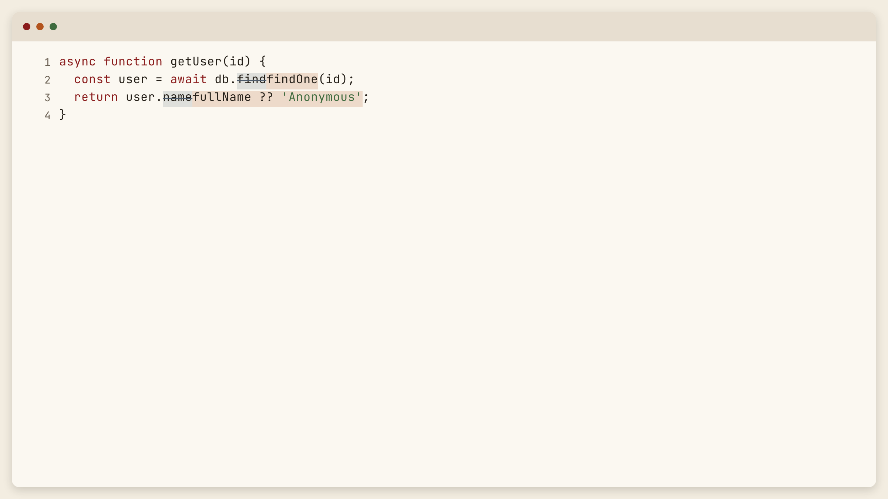

# Diff Poster

**▶ Live demo — [apps.charliekrug.com/diff-poster](https://apps.charliekrug.com/diff-poster/)**

[](https://github.com/ctkrug/diff-poster/actions/workflows/ci.yml)
[](LICENSE)

Turn a before/after code snippet into a single clean image of just the change.
Paste the old code, paste the new code, get a token-level diff styled like a tidy
editor window and sized for a tweet. No login, no export dialog, nothing uploaded.



## Who it's for

Developers sharing a specific code change: a clever one-liner, a bug fix, a small
refactor, dropped into a tweet, a PR description, or a Slack thread. Not slide decks or
blog carousels; that is a bigger tool's job. This is the "quote-tweet a diff" case:
fast, single-shot, disposable.

## Why token-level

Most diff screenshots paint a whole changed line red or green. Rewrite
`return 'hi ' + name;` as ``return `hello, ${name}!`;`` and a line diff just says
"this line changed" while hiding what actually changed. Diff Poster diffs at the token
level (identifiers, operators, literals, strings), so only the swapped tokens are
marked. The reader sees the exact substitution, which is the whole reason to share it.

Inline token diffing is at its best on localized edits. A wholesale rewrite (a
for-loop turned into a `reduce`) interleaves a lot of removed and added tokens, the
same way GitHub's word-diff does; the tool is tuned for the function-sized change, not
the full-file rewrite.

## Features

- **Token-level highlighting**, via a longest-common-subsequence diff over lexical
  tokens, so a renamed variable or a tweaked argument reads clearly instead of the
  whole line going red.
- **Editor-style output**: syntax coloring for JavaScript and Python, a plain-text
  fallback, subtle line numbers, and rounded window chrome, so it reads as a
  screenshot from a nice editor, not a raw `<pre>` block.
- **Sized for sharing** at 1200×675 (the 16:9 frame Twitter, Bluesky, and Slack use
  for previews), rendered onto a `<canvas>` at your screen's pixel density so the PNG
  stays crisp on retina displays.
- **One-click copy or download**: copy the PNG straight to your clipboard, or save it,
  with no export dialog. Where the browser can't write images to the clipboard, Copy
  is clearly disabled and Download always works.
- **Nothing leaves your browser**: tokenizing, diffing, and rendering all run
  client-side. No account, no backend, no stored snippets.

## Usage

1. Paste the original code into the **Before** pane, the changed code into **After**.
2. Pick the language (JavaScript, Python, or plain text) for syntax coloring.
3. Click **Generate image**.
4. **Copy image** or **Download PNG**, both one click, no dialog.

The download is named `diff-poster-YYYYMMDD-HHMMSS.png` so a folder of them sorts by
time.

## How it works

A static, client-only Vite app with no framework, plain DOM APIs over a handful of
pure modules:

`tokenize` (text → tokens, with strings and comments atomic) → `diffTokens` (LCS over
the two token streams) → `segmentsToRows` + `fitRows` (row splitting and sizing math)
→ `classifyToken` (syntax category per token) → `renderDiffToCanvas` (window chrome,
line numbers, syntax + diff coloring) → `canvasToBlob` (PNG for copy or download).

See [`docs/VISION.md`](docs/VISION.md) for the rationale,
[`docs/ARCHITECTURE.md`](docs/ARCHITECTURE.md) for the module map, and
[`docs/DESIGN.md`](docs/DESIGN.md) for the paper-and-ink design direction.

## Development

```
npm install
npm run dev       # local dev server
npm test          # vitest unit tests
npm run test:e2e  # playwright real-browser tests (npx playwright install first)
npm run lint      # eslint
npm run build     # static production build (output: site/)
```

Unit tests (jsdom) cover the diff, tokenizer, layout math, canvas rendering, and
export; the Playwright suite covers the real-browser behavior jsdom can't: computed
focus rings, `prefers-reduced-motion`, layout overflow, and font-blocked degradation.
Both run in CI.

## License

MIT. See [`LICENSE`](LICENSE).

More of Charlie's projects → https://apps.charliekrug.com
